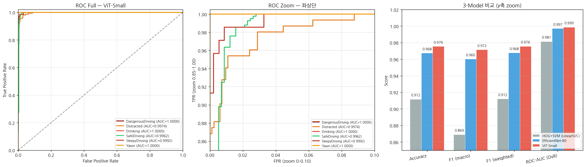
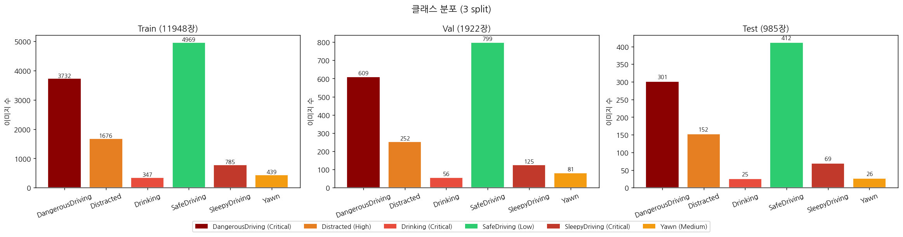
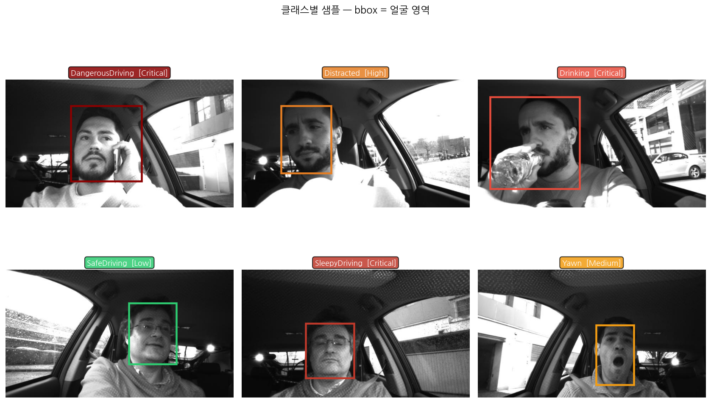
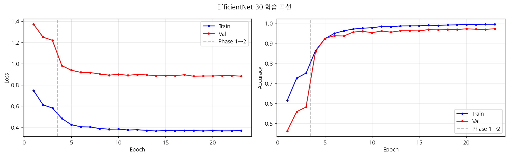
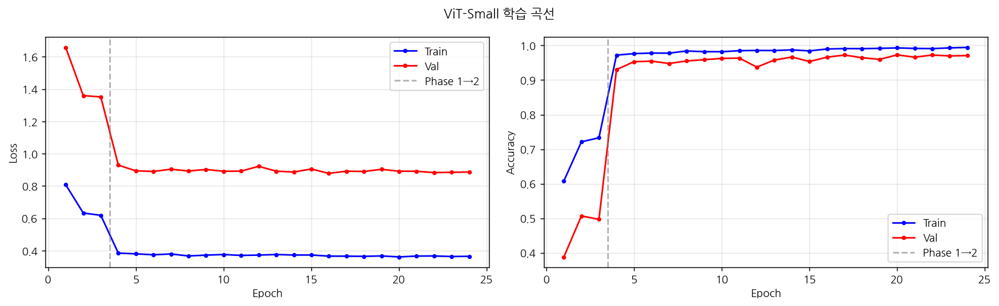
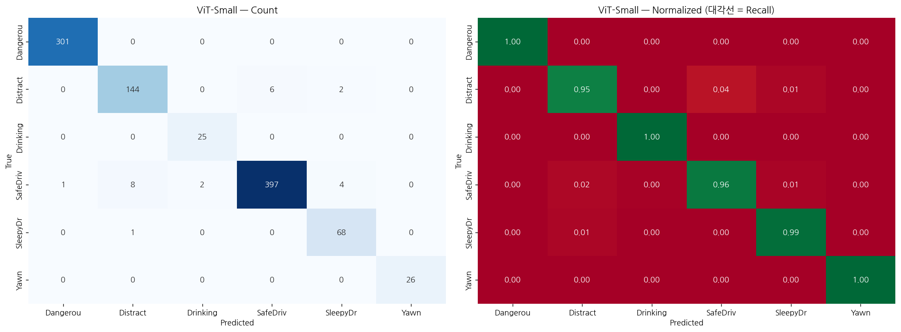
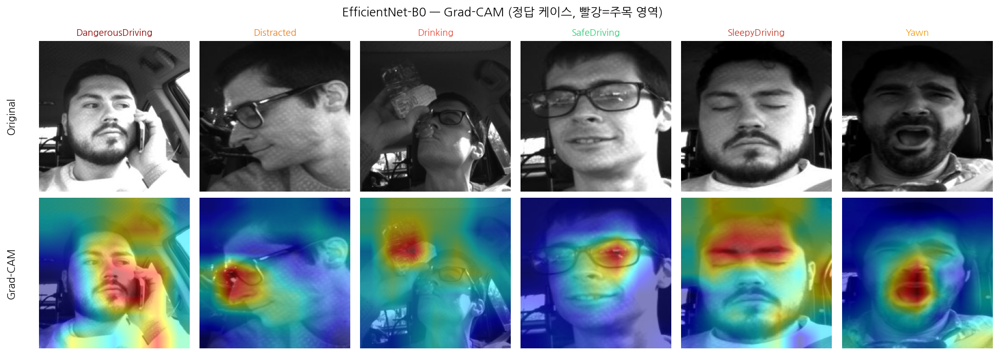
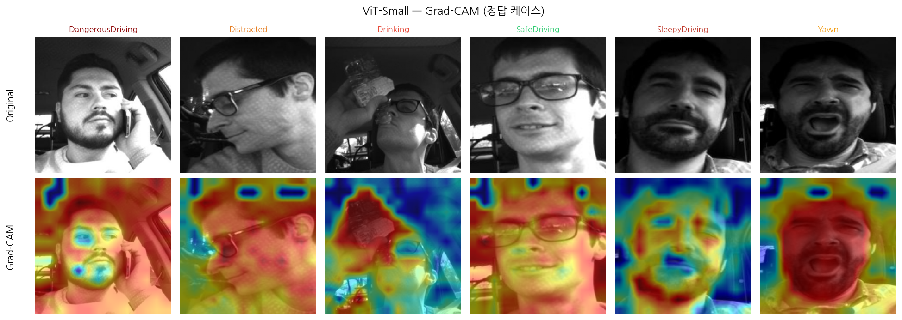
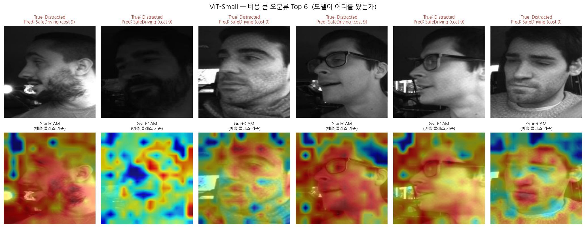

# IDRS: Integrated Driver Risk-Score System

**Unified Driver Inattention Detection using a Single GrayScale Camera**

[2026-1] Machine Learning Term Project · 인공지능공학과 · 12223552 서지민

---
## 📌 Overview

상업적 DMS가 고가의 IR 카메라와 전용 하드웨어를 요구하는 한계를 극복하기 위해,
**단일 grayscale 카메라만으로 운전자의 6가지 부주의 상태를 통합 분류**하는 시스템을 제안한다.

- **Classical(HOG+SVM) · CNN(EfficientNet-B0) · Transformer(ViT-Small)** 세 paradigm을 동일 조건에서 비교
- **단순 정확도를 넘어** Risk-weighted Cost · Reliability Diagram · Grad-CAM을 결합한 다층 평가 프레임워크 제안
- 6 classes: `SafeDriving`, `Distracted`, `Drinking`, `SleepyDriving`, `Yawn`, `DangerousDriving`

---
## 📊 Key Results

### Test Performance (n = 985)

| Model | Accuracy | F1 (macro) | ROC-AUC (OvR) | **Risk Score** | **Total Cost** |
|-------|:--------:|:----------:|:-------------:|:--------------:|:--------------:|
| HOG + LinearSVC | 0.9117 | 0.8690 | 0.9814 | 0.9735 | 418 |
| EfficientNet-B0 | 0.9675 | 0.9603 | 0.9972 | 0.9936 | 101 |
| **ViT-Small** | **0.9756** | **0.9716** | **0.9988** | **0.9952** | **75** |

<p align="center">
  
  <br>
  <em>Figure. (좌) ROC Full View — (중) Zoom view — (우) 3-Model 비교</em>
</p>

### Key Findings

-  **ViT-Small이 6개 지표 모두에서 근소하게 우위** — 특히 안전 직결 클래스(SleepyDriving Recall 0.99)
-  **위험도 가중 비용에서 ViT가 EffNet 대비 26% 낮음** (75 vs 101) — 같은 정확도라도 *오분류 방향*이 안전 비용에 결정적
-  **Grad-CAM 분석**: EfficientNet-B0는 국소적·집중형 attention, ViT-Small(Patch16)은 광역적·분산형 attention
-  **단일 failure mode**: 비용 큰 오분류 Top 6이 모두 "옆모습 Distracted → SafeDriving" 패턴 → grayscale 모달리티의 본질적 한계

---
## 🗂️ Repository Structure

```
├── README.md
├── requirements.txt ← pip 의존성
├── environment.yaml ← conda 환경 (대안)
├── .gitignore
│
├── notebooks/
│ ├── DriverInattention_Final.ipynb ← 학습 + 모델 저장, 위험도 분석
│ └── DriverInattention_Analysis.ipynb ← ROC, Grad-CAM, 신뢰도, 실패 분석
│
├── docs/
│ ├── report.pdf ← 최종 보고서
│ └── slides.pdf ← 발표 슬라이드 (5분)
│
├── results/
│ ├── comparison_table.csv ← 3-Model 종합 비교
│ ├── per_class_metrics.csv ← 클래스별 P/R/F1
│ └── figures/ ← EDA, 학습 곡선, CM, Grad-CAM 등 각종 결과 사진
│
└── data/
└── README.md ← 데이터셋 다운로드 안내
```

---
## ⚙️ Environment Setup(Google Colab 환경 기준)
Python  : 3.12.13
PyTorch : 2.10.0
CUDA : 12.8
GPU : Tesla T4
GPU memory: 15.6 GB

### Option A - pip
```
bash
git clone (https://github.com/seojimin03/Integration-Driver-Risk-Score-IDRS-.git)
cd idrs-driver-inattention
pip install -r requirements.txt
```

---
## Dataset
본 연구는 Kaggle에서 (Driver Monitoring Dataset, v6, CC BY 4.0) 를 사용한다.

https://www.kaggle.com/datasets/zeyad1mashhour/driver-inattention-detection-dataset/code
다운로드 후 `data/` 폴더 아래 다음 구조로 배치한다:
```
data/
├── train/
│ ├── _annotations.txt
│ ├── _classes.txt
│ └── *.jpg (11,948장)
├── valid/
│ ├── _annotations.txt
│ ├── _classes.txt
│ └── *.jpg (1,922장)
└── test/
├── _annotations.txt
├── _classes.txt
└── *.jpg (985장)
```
- **Annotation format**: YOLO v3 (Keras), `filename x1,y1,x2,y2,class_idx`
- **Classes (index 순)**: `DangerousDriving`, `Distracted`, `Drinking`, `SafeDriving`, `SleepyDriving`, `Yawn`
<p align="center">
  
  <br>
  <em>Figure. 클래스 분포 (Train / Val / Test) — 최대 16:1 불균형</em>
</p>
<p align="center">
  
  <br>
  <em>Figure. 클래스별 샘플 이미지 (bbox = 행동 단서 포함 영역)</em>
</p>

---

## Reproduction Guide
**Scenario A** 학습부터(Colab T4 GPU)

1. notebooks/DriverInattention_Final.ipynb 열기
2. 셀 내 DATASET_PATH를 본인 Drive 경로로 수정
3. 위에서부터 순차 실행 → 결과는 /content/drive/.../results/ 에 자동 저장

**Scenario B** - 학습 스킵, 저장된 가중치만 사용

1. 사전 학습 가중치 다운로드:
- effnet_b0_final.pth (~21 MB)
- vit_small_final.pth (~85 MB)
- hog_svm.joblib (~수 MB)
- test_results.npz, meta.json, df_test.parquet
2. Drive의 results/ 디렉토리에 업로드
3. notebooks/DriverInattention_Analysis.ipynb 실행 → ROC, Grad-CAM, 신뢰도 분석 자동 생성

---
## Methodology Summary
**Preprocessing**
- bbox 기반 얼굴 영역 크롭 (+20% padding)
- 224×224 리사이즈, grayscale → 3-channel 복제
- ImageNet 통계량으로 정규화

**Class Imbalance Handling**
- WeightedRandomSampler (배치 단위 균형)
- CrossEntropyLoss(weight='balanced') (loss 단위 가중)

**Training Strategy (DL models)**
- 2-Phase Fine-tuning: Head warmup (3 epoch) → Full fine-tuning (max 30, Early Stop patience=5(EfficientNet-B0), 8(ViT-Small)
- Optimizer: AdamW (weight_decay=1e-3)
- LR Scheduler: Cosine Annealing (eta_min=1e-6)
- Loss: CrossEntropyLoss + Label Smoothing 0.1

**Evaluation Metrics**
- Standard: Accuracy, Precision/Recall (macro), F1 (macro/weighted), ROC-AUC (OvR)
- **Domain-specific**: Risk-weighted Score with quadratic cost
- (Risk levels: Low(1) < Medium(2) < High(3) < Critical(4))
- **cost(i,j) = max(1,risk(i)−risk(j)+1)^2**

---
## Visual Analysis
Training Curves
<p align="center">   <br> <em>Figure. EfficientNet-B0(좌) 및 ViT-Small(우) 학습 곡선 — Phase 1→2 전환 표시</em> </p>
Confusion Matrix
<p align="center">   <br> <em>Figure. Confusion Matrix — Count(좌) & Recall 정규화(우)</em> </p>
Grad-CAM Interpretation
<p align="center">  <br> <em>Figure. EfficientNet-B0 — 국소적·집중형 attention (눈, 입, 컵 등 단서 영역)</em> </p> <p align="center">  <br> <em>Figure. ViT-Small — 광역적·분산형 attention (얼굴 전체 + 주변 context)</em> </p>
Failure Case Analysis
<p align="center">  <br> <em>Figure. 비용 큰 오분류 Top 6 — 옆모습 Distracted → SafeDriving 단일 패턴</em> </p>

---
## License
Code: MIT License
Dataset(DMD): https://www.kaggle.com/datasets/zeyad1mashhour/driver-inattention-detection-dataset/code

---
## Author
**인공지능공학과 12223552 서지민**
